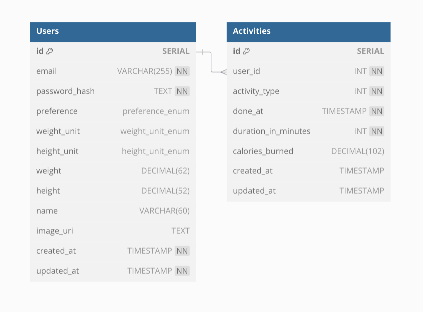

## Table of Contents
1. [Introduction](#introduction)
2. [Benchmarking](#benchmarking)
3. [Appendix](#appendix)

## 1. Introduction <a name="introduction"></a>
This blog is made to learn and know the benchmark of database indexes based using `EXPLAIN ANALYZE` query in PostgreSQL v16.3.

The testing is done on a database schema from my open project with team. The project itself is focused on how to measure team's perfomance based on the submitted project as an HTTP server app by load testing it.

This benchmark is done on the second week of the project which require to create the app to handle two entities: User & Activity.

You can see the table schema being used in this benchmark in the [ddl.sql](./ddl.sql "Table Schema DDL") file.

There are 1500 users and 6000 activities records generated for this testing as you can also see the DDL in [users_and_activities.sql](./users_and_activities.sql "Data Generation DDL")

The ERD is represented as follows:



For this specific benchmark, I'm focusing to discover the ideal indexing to be used on one of the API endpoint being tested on the project which is `GET $BASE_URL/v1/activity`. This endpoint has optional parameters: 
- `limit`, refer to the `LIMIT` SQL expression.
- `offset`, refer to the `OFFSET` SQL expression.
- `activityType`, refer to `activity_type` column.
- `doneAtFrom`, refer to `done_at` column.
- `doneAtTo`, refer to `done_at` column.
- `caloriesBurnedMin`, refer to `calories_burned` column.
- `caloriesBurnedMax`, refer to `calories_burned` column.

## 2. Benchmarking <a name="benchmarking"></a>
The indexes being measured are adjusted to what expected to be more performant from case to case.
The initial cases will use Hash index and B-Tree index as they are estimated more optimized for the given filtering condition.

The cases being benchmarked are as follows:
1. [Activity_Type](#case-1)
2. [Activity_Type & Limit & Offset](#case-2)
3. [Done_At & Limit & Offset](#case-3)
4. [Activity_Type & Done_At & Limit & Offset](#case-4)
5. [Activity_Type & Done_At & Calories_Burned & Limit & Offset](#case-5)
6. [Activity_Type & Calories_Burned & Limit & Offset](#case-6)
7. [Done_At & Activity_Type & Limit & Offset](#case-7)
8. [ Done_At & Calories_Burned & Limit & Offset](#case-8)
9. [Insert An Activity Record](#case-9)

Note: 

The specific values used for each cases are same as follows:
- Activity_Type = 5
- Done_At from '2024-08-01' to '2024-09-15'
- Calories_Burned from 500 to 800
- Limit = 6000
- Offset = 10

For reference to the metrics being used in PostgreSQL, you can refer the [Internals of PostgreSQL by Hironobu Suzuki](https://www.interdb.jp/pg/pgsql03/02.html)

### 1. Activity_Type  <a name="case-1"></a>
Query: 
```
EXPLAIN ANALYZE SELECT 
  id, 
  activity_type, 
  done_at, 
  duration_in_minutes, 
  calories_burned, 
  created_at 
FROM activities
WHERE activity_type=5;
```
Indexing Type            | Cost Estimation |  Actual Time   |  Planning Time  |  Execution Time |
------------------------ | --------------- | -------------- | --------------- | --------------- |
Without Index            | 0.00..137.00    | 0.023..1.919   | 0.243 ms        |  2.064 ms       |
Hash (activity_type)     | 0.00..126.54    | 0.149..1.417   | 0.177 ms        |  1.607 ms       |
B-Tree (activity_type)   | 0.00..94.83     | 0.110..1.088   | 0.156 ms        |  1.262 ms       |

### 2. Activity_Type & Limit & Offset <a name="case-2"></a>
Query: 
```
EXPLAIN ANALYZE SELECT 
  id, 
  activity_type, 
  done_at, 
  duration_in_minutes, 
  calories_burned, 
  created_at 
FROM activities 
WHERE activity_type = 5 
LIMIT 6000 
OFFSET 10;
```
Indexing Type                                  | Cost Estimation |  Actual Time   |  Planning Time  |  Execution Time |
---------------------------------------------- | --------------- | -------------- | --------------- | --------------- |
Without Index                                  | 0.00..137.00    | 0.028..2.506   | 0.171 ms        |  2.679 ms       |
Hash (activity_type)                           | 0.00..127.54    | 0.159..1.687   | 0.201 ms        |  1.885 ms       |
Hash (activity_type) + B-Tree (activity_type)  | 0.00..126.54    | 0.138..1.453   | 0.172 ms        |  1.628 ms       |
B-Tree (activity_type)                         | 0.00..94.83     | 0.110..1.126   | 0.183 ms        |  1.532 ms       |

Note: When B-Tree & Hash index are coexisted, the query ran by `EXPLAIN ANALYZE` only shows B-Tree Index being used without Hash Index (see the query tree result in appendix). 

### 3. Done_At & Limit & Offset <a name="case-3"></a>
Query: 
```
EXPLAIN ANALYZE SELECT 
  id, 
  activity_type, 
  done_at, 
  duration_in_minutes, 
  calories_burned, 
  created_at 
FROM activities 
WHERE 
  done_at BETWEEN '2024-08-01 00:00:00' AND '2024-09-15 00:00:00' 
LIMIT 6000 
OFFSET 10;
```
Indexing Type      | Cost Estimation |  Actual Time   |  Planning Time  |  Execution Time |
------------------ | --------------- | -------------- | --------------- | --------------- |
Without Index      | 0.00..152.00    | 0.025..2.209   | 0.169 ms        |  2.313 ms       |
B-Tree (done_at)   | 0.00..92.49     | 0.149..1.011   | 0.208 ms        |  1.133 ms       |

Note: Since the Hash seems under-prioritize over the B-Tree index based on previous case, 
I decided to focus utilizing the B-Tree and figuring out the right composition to be used with.

### 4. Activity_Type & Done_At & Limit & Offset <a name="case-4"></a>
Query: 
```
EXPLAIN ANALYZE SELECT 
  id, 
  activity_type, 
  done_at, 
  duration_in_minutes, 
  calories_burned, 
  created_at 
FROM activities 
WHERE 
  activity_type = 5 
  AND done_at BETWEEN '2024-08-01 00:00:00' and '2024-09-15 00:00:00' 
LIMIT 6000 
OFFSET 10;
```
Indexing Type                                 | Cost Estimation |  Actual Time   |  Planning Time  |  Execution Time |
--------------------------------------------- | --------------- | -------------- | --------------- | --------------- |
Without Index                                 | 0.00..167.00    | 0.038..1.959   | 0.177 ms        |  2.007 ms       |
B-Tree (activity_type) + B-Tree (done_at)     | 0.00..94.15     | 0.188..0.754   | 0.286 ms        |  0.823 ms       |
B-Tree (activity_type, done_at)               | 0.00..70.70     | 0.064..0.357   | 0.223 ms        |  0.423 ms       |

### 5. Activity_Type & Done_At & Calories_Burned & Limit & Offset <a name="case-5"></a>
Query: 
```
EXPLAIN ANALYZE SELECT 
  id, 
  activity_type, 
  done_at, 
  duration_in_minutes, 
  calories_burned, 
  created_at 
FROM activities 
WHERE 
  activity_type = 5 
  AND done_at BETWEEN '2024-08-01 00:00:00' AND '2024-09-15 00:00:00' 
  AND calories_burned BETWEEN 500 AND 800 
LIMIT 6000 
OFFSET 10;
```
Indexing Type                                                         | Cost Estimation |  Actual Time   |  Planning Time  |  Execution Time |
--------------------------------------------------------------------- | --------------- | -------------- | --------------- | --------------- |
Without Index                                                         | 0.00..198.67    | 0.148..2.412   | 0.423 ms        |  2.455 ms       |
B-Tree (activity_type) + B-Tree (done_at)                             | 0.00..97.72     | 0.150..0.939   | 0.367 ms        |  0.997 ms       |
B-Tree (activity_type) + B-Tree (done_at) + B-Tree (calories_burned)  | 0.00..97.72     | 0.148..1.010   | 0.415 ms        |  1.068 ms       |
B-Tree (activity_type, done_at, calories_burned)                      | 0.00..65.12     | 0.102..0.235   | 0.425 ms        |  0.331 ms       |

### 6. Activity_Type & Calories_Burned & Limit & Offset <a name="case-6"></a>
Query: 
```
EXPLAIN ANALYZE SELECT
  id, 
  activity_type, 
  done_at, 
  duration_in_minutes, 
  calories_burned, 
  created_at 
FROM activities 
WHERE 
  activity_type = 5 
  AND calories_burned BETWEEN 500 AND 800 
LIMIT 6000 
OFFSET 10;
```
Indexing Type                                     | Cost Estimation |  Actual Time   |  Planning Time  |  Execution Time |
------------------------------------------------- | --------------- | -------------- | --------------- | --------------- |
Without Index                                     | 0.00..168.00    | 0.076..3.624   | 0.269 ms        |  3.689 ms       |
B-Tree (activity_type) + B-Tree (calories_burned) | 0.00..101.66    | 0.116..1.410   | 0.410 ms        |  1.499 ms       |
B-Tree (activity_type, done_at, calories_burned)  | 0.00..112.13    | 0.401..0.940   | 0.434 ms        |  1.031 ms       |
B-Tree (activity_type, calories_burned)           | 0.00..80.99     | 0.212..0.645   | 0.319 ms        |  0.727 ms       |

### 7. Done_At & Activity_Type & Limit & Offset <a name="case-7"></a>
Query: 
```
EXPLAIN ANALYZE SELECT 
  id, 
  activity_type, 
  done_at, 
  duration_in_minutes, 
  calories_burned, 
  created_at 
FROM activities 
WHERE 
  done_at BETWEEN '2024-08-01 00:00:00' AND '2024-09-15 00:00:00' 
  AND activity_type = 5 
LIMIT 6000 
OFFSET 10;
```
Indexing Type                                    | Cost Estimation |  Actual Time   |  Planning Time  |  Execution Time |
------------------------------------------------ | --------------- | -------------- | --------------- | --------------- |
B-Tree (activity_type, done_at, calories_burned) | 0.00..71.70     | 0.115..0.567   | 0.356 ms        |  0.673 ms       |

Note: Since the execution time of `B-Tree (activity_type, done_at, calories_burned)` in case #5 getting slower compared to case #6,
I'm assuming there is a chance that the order of columns being filtered by `where` clause will take effect on perfomance.
But doesnt seems so after I tried multiple times running both vice-versa ordering of done_at and activity_type as it looks neglible.
This also mean that this result is comparable to case #4.

### 8. Done_At & Calories_Burned & Limit & Offset <a name="case-8"></a>
Query: 
```
EXPLAIN ANALYZE SELECT 
  id, 
  activity_type, 
  done_at, 
  duration_in_minutes, 
  calories_burned, 
  created_at 
FROM activities 
WHERE 
  done_at BETWEEN '2024-08-01 00:00:00' AND '2024-09-15 00:00:00' 
  AND calories_burned BETWEEN 500 AND 800 
LIMIT 6000 
OFFSET 10;
```
Indexing Type                                                                         | Cost Estimation |  Actual Time   |  Planning Time  |  Execution Time |
------------------------------------------------------------------------------------- | --------------- | -------------- | --------------- | --------------- |
Without Index                                                                         | 0.00..183.00    | 0.033..2.370   | 0.322 ms        |  2.426 ms       |
B-Tree (activity_type, done_at, calories_burned)                                      | 0.00..182.00    | 0.032..2.369   | 0.301 ms        |  2.422 ms       |
B-Tree (activity_type, done_at, calories_burned) + B-Tree (done_at, calories_burned)  | 0.00..93.97     | 0.350..0.730   | 0.368 ms        |  0.820 ms      |
B-Tree (done_at, calories_burned)                                                     | 0.00..93.97     | 0.348..0.724   | 0.453 ms        |  0.800 ms       |

### 9. Insert An Activity Record <a name="case-9"></a>
Query: 
```
EXPLAIN ANALYZE INSERT INTO Activities (
  id, 
  user_id, 
  activity_type, 
  done_at, 
  duration_in_minutes, 
  calories_burned, 
  created_at, 
  updated_at
) VALUES (
  6018, 
  1,
  3, 
  '2024-04-24 00:42:05.530305', 
  113, 
  636.41, 
  '2024-04-24 00:42:05.530305', 
  '2024-04-24 00:42:05.530305'
);
```
Indexing Type                                                                        | Cost Estimation |  Actual Time   |  Planning Time  |  Execution Time |
------------------------------------------------------------------------------------ | --------------- | -------------- | --------------- | --------------- |
B-Tree (activity_type, done_at, calories_burned)                                     | 0.00..0.01      | 0.003..0.111   | 0.063 ms        |  0.259 ms       |
B-Tree (done_at, calories_burned) + B-Tree (activity_type, done_at, calories_burned) | 0.00..0.01      | 0.003..0.120   | 0.062 ms        |  0.403 ms       |
Without Index                                                                        | 0.00..0.01      | 0.003..0.152   | 0.062 ms        |  0.287 ms       |

## 3. Appendix <a name="appendix"></a>
1. [Activity_Type](#appendix-1)
2. [Activity_Type & Limit & Offset](#appendix-2)
3. [Done_At & Limit & Offset](#appendix-3)
4. [Activity_Type & Done_At & Limit & Offset](#appendix-4)
5. [Activity_Type & Done_At & Calories_Burned & Limit & Offset](#appendix-5)
6. [Activity_Type & Calories_Burned & Limit & Offset](#appendix-6)
7. [Done_At & Activity_Type & Limit & Offset](#appendix-7)
8. [Done_At & Calories_Burned & Limit & Offset](#appendix-8)
9. [Insert An Activity Record](#appendix-9)

### 1. Activity_Type <a name="appendix-1"></a>

#### 1.1 Without Index
```
ps2_experiment=# explain analyze select id, activity_type, done_at, duration_in_minutes, calories_burned, created_at from activities where activity_type=5;
                                                 QUERY PLAN                                                  
-------------------------------------------------------------------------------------------------------------
 Seq Scan on activities  (cost=0.00..137.00 rows=1212 width=34) (actual time=0.023..1.919 rows=1212 loops=1)
   Filter: (activity_type = 5)
   Rows Removed by Filter: 4788
 Planning Time: 0.243 ms
 Execution Time: 2.064 ms
(5 rows)
```

#### 1.2 Hash (activity_type)
```
ps2_experiment=# explain analyze select id, activity_type, done_at, duration_in_minutes, calories_burned, created_at from activities where activity_type=5;
                                                             QUERY PLAN                                                             
------------------------------------------------------------------------------------------------------------------------------------
 Bitmap Heap Scan on activities  (cost=49.39..126.54 rows=1212 width=34) (actual time=0.205..1.417 rows=1212 loops=1)
   Recheck Cond: (activity_type = 5)
   Heap Blocks: exact=62
   ->  Bitmap Index Scan on activities_type_hash  (cost=0.00..49.09 rows=1212 width=0) (actual time=0.149..0.150 rows=1212 loops=1)
         Index Cond: (activity_type = 5)
 Planning Time: 0.177 ms
 Execution Time: 1.607 ms
(7 rows)
```

#### 1.3 B-Tree (activity_type)
```
ps2_experiment=# explain analyze select id, activity_type, done_at, duration_in_minutes, calories_burned, created_at from activities where activity_type=5;
                                                             QUERY PLAN                                                              
-------------------------------------------------------------------------------------------------------------------------------------
 Bitmap Heap Scan on activities  (cost=17.68..94.83 rows=1212 width=34) (actual time=0.157..1.088 rows=1212 loops=1)
   Recheck Cond: (activity_type = 5)
   Heap Blocks: exact=62
   ->  Bitmap Index Scan on activities_type_btree  (cost=0.00..17.37 rows=1212 width=0) (actual time=0.110..0.110 rows=1212 loops=1)
         Index Cond: (activity_type = 5)
 Planning Time: 0.156 ms
 Execution Time: 1.262 ms
(7 rows)
```

### 2. Activity_Type & Limit & Offset <a name="appendix-2"></a>

#### 2.1 Without Index
```
ps2_experiment=# explain analyze select id, activity_type, done_at, duration_in_minutes, calories_burned, created_at from activities where activity_type=5 limit 6000 offset 10;
                                                    QUERY PLAN                                                     
-------------------------------------------------------------------------------------------------------------------
 Limit  (cost=1.13..137.00 rows=1202 width=34) (actual time=0.043..2.506 rows=1202 loops=1)
   ->  Seq Scan on activities  (cost=0.00..137.00 rows=1212 width=34) (actual time=0.028..2.233 rows=1212 loops=1)
         Filter: (activity_type = 5)
         Rows Removed by Filter: 4788
 Planning Time: 0.171 ms
 Execution Time: 2.679 ms
(6 rows)
```

#### 2.2 Hash (activity_type)
```
ps2_experiment=# EXPLAIN ANALYZE SELECT 
  id, 
  activity_type, 
  done_at, 
  duration_in_minutes, 
  calories_burned, 
  created_at 
FROM activities 
WHERE activity_type = 5 
LIMIT 6000 
OFFSET 10;
                                                          QUERY PLAN                                                           
-------------------------------------------------------------------------------------------------------------------------------
 Limit  (cost=50.04..127.54 rows=1202 width=34) (actual time=0.228..1.687 rows=1202 loops=1)
   ->  Bitmap Heap Scan on activities  (cost=49.39..127.54 rows=1212 width=34) (actual time=0.215..1.415 rows=1212 loops=1)
         Recheck Cond: (activity_type = 5)
         Heap Blocks: exact=62
         ->  Bitmap Index Scan on type_hash  (cost=0.00..49.09 rows=1212 width=0) (actual time=0.159..0.160 rows=1212 loops=1)
               Index Cond: (activity_type = 5)
 Planning Time: 0.201 ms
 Execution Time: 1.885 ms
(8 rows)
```

#### 2.3 Hash (activity_type) + B-Tree (activity_type)
```
ps2_experiment=# explain analyze select id, activity_type, done_at, duration_in_minutes, calories_burned, created_at from activities where activity_type=5 limit 6000 offset 10;
                                                                QUERY PLAN                                                                
------------------------------------------------------------------------------------------------------------------------------------------
 Limit  (cost=50.03..126.54 rows=1202 width=34) (actual time=0.216..1.453 rows=1202 loops=1)
   ->  Bitmap Heap Scan on activities  (cost=49.39..126.54 rows=1212 width=34) (actual time=0.197..1.207 rows=1212 loops=1)
         Recheck Cond: (activity_type = 5)
         Heap Blocks: exact=62
         ->  Bitmap Index Scan on activities_type_hash  (cost=0.00..49.09 rows=1212 width=0) (actual time=0.138..0.140 rows=1212 loops=1)
               Index Cond: (activity_type = 5)
 Planning Time: 0.172 ms
 Execution Time: 1.628 ms
(8 rows)
```

#### 2.4 B-Tree (activity_type)
```
ps2_experiment=# explain analyze select id, activity_type, done_at, duration_in_minutes, calories_burned, created_at from activities where activity_type=5 limit 6000 offset 10;
                                                                QUERY PLAN                                                                 
-------------------------------------------------------------------------------------------------------------------------------------------
 Limit  (cost=18.31..94.83 rows=1202 width=34) (actual time=0.170..1.365 rows=1202 loops=1)
   ->  Bitmap Heap Scan on activities  (cost=17.68..94.83 rows=1212 width=34) (actual time=0.159..1.126 rows=1212 loops=1)
         Recheck Cond: (activity_type = 5)
         Heap Blocks: exact=62
         ->  Bitmap Index Scan on activities_type_btree  (cost=0.00..17.37 rows=1212 width=0) (actual time=0.111..0.112 rows=1212 loops=1)
               Index Cond: (activity_type = 5)
 Planning Time: 0.183 ms
 Execution Time: 1.532 ms
(8 rows)
```

### 3. Done_At & Limit & Offset <a name="appendix-3"></a>

#### 3.1 Without Index
```
ps2_experiment=# explain analyze select id, activity_type, done_at, duration_in_minutes, calories_burned, created_at from activities where done_at between '2024-08-01 00:00:00' and '2024-09-15 00:00:00' limit 6000 offset 10;
                                                                      QUERY PLAN                                                                       
-------------------------------------------------------------------------------------------------------------------------------------------------------
 Limit  (cost=2.11..152.00 rows=711 width=34) (actual time=0.062..2.209 rows=714 loops=1)
   ->  Seq Scan on activities  (cost=0.00..152.00 rows=721 width=34) (actual time=0.025..2.065 rows=724 loops=1)
         Filter: ((done_at >= '2024-08-01 00:00:00'::timestamp without time zone) AND (done_at <= '2024-09-15 00:00:00'::timestamp without time zone))
         Rows Removed by Filter: 5276
 Planning Time: 0.169 ms
 Execution Time: 2.313 ms
(6 rows)
```

#### 3.2 B-Tree (done_at)
```
ps2_experiment=# explain analyze select id, activity_type, done_at, duration_in_minutes, calories_burned, created_at from activities where done_at between '2024-08-01 00:00:00' and '2024-09-15 00:00:00' limit 6000 offset 10;
                                            QUERY PLAN                                            
--------------------------------------------------------------------------------------------------
 Limit  (cost=20.68..92.49 rows=711 width=34) (actual time=0.206..1.011 rows=714 loops=1)
   ->  Bitmap Heap Scan on activities  (cost=19.67..92.49 rows=721 width=34) (actual time=0.189..0.868 rows=724 loops=1)
         Recheck Cond: ((done_at >= '2024-08-01 00:00:00'::timestamp without time zone) AND (done_at <= '2024-09-15 00:00:00'::timestamp without time zone))
         Heap Blocks: exact=62
         ->  Bitmap Index Scan on done_at_btree  (cost=0.00..19.49 rows=721 width=0) (actual time=0.149..0.150 rows=724 loops=1)
               Index Cond: ((done_at >= '2024-08-01 00:00:00'::timestamp without time zone) AND (done_at <= '2024-09-15 00:00:00'::timestamp without time zone))
 Planning Time: 0.208 ms
 Execution Time: 1.133 ms
(8 rows)
```

### 4. Activity_Type & Done_At & Limit & Offset <a name="appendix-4"></a>

#### 4.1 Without Index
```
ps2_experiment=# explain analyze select id, activity_type, done_at, duration_in_minutes, calories_burned, created_at from activities where activity_type = 5 and done_at between '2024-08-01 00:00:00' and '2024-09-15 00:00:00' limit 6000 offset 10;
                                            QUERY PLAN                                            
--------------------------------------------------------------------------------------------------
 Limit  (cost=11.44..167.00 rows=136 width=34) (actual time=0.253..1.959 rows=133 loops=1)
   ->  Seq Scan on activities  (cost=0.00..167.00 rows=146 width=34) (actual time=0.038..1.928 rows=143 loops=1)
         Filter: ((done_at >= '2024-08-01 00:00:00'::timestamp without time zone) AND (done_at <= '2024-09-15 00:00:00'::timestamp without time zone) AND (activity_type = 5))
         Rows Removed by Filter: 5857
 Planning Time: 0.177 ms
 Execution Time: 2.007 ms
(6 rows)
```

#### 4.2 B-Tree (activity_type) + B-Tree (done_at)
```
ps2_experiment=# explain analyze select id, activity_type, done_at, duration_in_minutes, calories_burned, created_at from activities where activity_type = 5 and done_at between '2024-08-01 00:00:00' and '2024-09-15 00:00:00' limit 6000 offset 10;
                                            QUERY PLAN                                            
--------------------------------------------------------------------------------------------------
 Limit  (cost=24.64..94.15 rows=136 width=34) (actual time=0.285..0.754 rows=133 loops=1)
   ->  Bitmap Heap Scan on activities  (cost=19.53..94.15 rows=146 width=34) (actual time=0.235..0.723 rows=143 loops=1)
         Recheck Cond: ((done_at >= '2024-08-01 00:00:00'::timestamp without time zone) AND (done_at <= '2024-09-15 00:00:00'::timestamp without time zone))
         Filter: (activity_type = 5)
         Rows Removed by Filter: 581
         Heap Blocks: exact=62
         ->  Bitmap Index Scan on done_at_btree  (cost=0.00..19.49 rows=721 width=0) (actual time=0.188..0.189 rows=724 loops=1)
               Index Cond: ((done_at >= '2024-08-01 00:00:00'::timestamp without time zone) AND (done_at <= '2024-09-15 00:00:00'::timestamp without time zone))
 Planning Time: 0.286 ms
 Execution Time: 0.823 ms
(10 rows)
```

#### 4.3 B-Tree (activity_type, done_at) 
```
ps2_experiment=# explain analyze select id, activity_type, done_at, duration_in_minutes, calories_burned, created_at from activities where activity_type = 5 and done_at between '2024-08-01 00:00:00' and '2024-09-15 00:00:00' limit 6000 offset 10;
                                            QUERY PLAN                                            
--------------------------------------------------------------------------------------------------
 Limit  (cost=10.57..70.70 rows=136 width=34) (actual time=0.134..0.357 rows=133 loops=1)
   ->  Bitmap Heap Scan on activities  (cost=6.14..70.70 rows=146 width=34) (actual time=0.101..0.324 rows=143 loops=1)
         Recheck Cond: ((activity_type = 5) AND (done_at >= '2024-08-01 00:00:00'::timestamp without time zone) AND (done_at <= '2024-09-15 00:00:00'::timestamp without time 
zone))
         Heap Blocks: exact=56
         ->  Bitmap Index Scan on type_and_done_at_btree  (cost=0.00..6.11 rows=146 width=0) (actual time=0.064..0.065 rows=143 loops=1)
               Index Cond: ((activity_type = 5) AND (done_at >= '2024-08-01 00:00:00'::timestamp without time zone) AND (done_at <= '2024-09-15 00:00:00'::timestamp without t
ime zone))
 Planning Time: 0.223 ms
 Execution Time: 0.423 ms
(8 rows)
```

### 5. Activity_Type & Done_At & Calories_Burned & Limit & Offset <a name="appendix-5"></a>

#### 5.1 Without Index
```
ps2_experiment=# EXPLAIN ANALYZE SELECT 
  id, 
  activity_type, 
  done_at, 
  duration_in_minutes, 
  calories_burned, 
  created_at 
FROM activities 
WHERE 
  activity_type = 5 
  AND done_at BETWEEN '2024-08-01 00:00:00' AND '2024-09-15 00:00:00' 
  AND calories_burned BETWEEN 500 AND 800 
LIMIT 6000 
OFFSET 10;
                                            QUERY PLAN                                            
--------------------------------------------------------------------------------------------------
 Limit  (cost=50.94..198.67 rows=29 width=34) (actual time=0.942..2.412 rows=26 loops=1)
   ->  Seq Scan on activities  (cost=0.00..198.67 rows=39 width=34) (actual time=0.148..2.401 rows=36 loops=1)
         Filter: ((done_at >= '2024-08-01 00:00:00'::timestamp without time zone) AND (done_at <= '2024-09-15 00:00:00'::timestamp without time zone) AND (calories_burned >= '500'::
numeric) AND (calories_burned <= '800'::numeric) AND (activity_type = 5))
         Rows Removed by Filter: 5964
 Planning Time: 0.423 ms
 Execution Time: 2.455 ms
(6 rows)
```

#### 5.2 B-Tree (activity_type) + B-Tree (done_at)
```
ps2_experiment=# explain analyze select id, activity_type, done_at, duration_in_minutes, calories_burned, created_at from activities where activity_type = 5 and done_at between '2024-08-01 00:00:00' and '2024-09-15 00:00:00' and calories_burned between 500 and 800 limit 6000 offset 10;
                                            QUERY PLAN                                            
--------------------------------------------------------------------------------------------------
 Limit  (cost=39.56..97.72 rows=29 width=34) (actual time=0.462..0.939 rows=26 loops=1)
   ->  Bitmap Heap Scan on activities  (cost=19.50..97.72 rows=39 width=34) (actual time=0.226..0.929 rows=36 loops=1)
         Recheck Cond: ((done_at >= '2024-08-01 00:00:00'::timestamp without time zone) AND (done_at <= '2024-09-15 00:00:00'::timestamp without time zone))
         Filter: ((calories_burned >= '500'::numeric) AND (calories_burned <= '800'::numeric) AND (activity_type = 5))
         Rows Removed by Filter: 688
         Heap Blocks: exact=62
         ->  Bitmap Index Scan on done_at_btree  (cost=0.00..19.49 rows=721 width=0) (actual time=0.150..0.150 rows=724 loops=1)
               Index Cond: ((done_at >= '2024-08-01 00:00:00'::timestamp without time zone) AND (done_at <= '2024-09-15 00:00:00'::timestamp without time zone))
 Planning Time: 0.367 ms
 Execution Time: 0.997 ms
(10 rows)
```

#### 5.3 B-Tree (activity_type) + B-Tree (done_at) + B-Tree (calories_burned)
```
ps2_experiment=# explain analyze select id, activity_type, done_at, duration_in_minutes, calories_burned, created_at from activities where activity_type = 5 and done_at between '2024-08-01 00:00:00' and '2024-09-15 00:00:00' and calories_burned between 500 and 800 limit 6000 offset 10;
                                            QUERY PLAN                                            
--------------------------------------------------------------------------------------------------
 Limit  (cost=39.56..97.72 rows=29 width=34) (actual time=0.543..1.010 rows=26 loops=1)
   ->  Bitmap Heap Scan on activities  (cost=19.50..97.72 rows=39 width=34) (actual time=0.268..0.999 rows=36 loops=1)
         Recheck Cond: ((done_at >= '2024-08-01 00:00:00'::timestamp without time zone) AND (done_at <= '2024-09-15 00:00:00'::timestamp without time zone))
         Filter: ((calories_burned >= '500'::numeric) AND (calories_burned <= '800'::numeric) AND (activity_type = 5))
         Rows Removed by Filter: 688
         Heap Blocks: exact=62
         ->  Bitmap Index Scan on done_at_btree  (cost=0.00..19.49 rows=721 width=0) (actual time=0.148..0.149 rows=724 loops=1)
               Index Cond: ((done_at >= '2024-08-01 00:00:00'::timestamp without time zone) AND (done_at <= '2024-09-15 00:00:00'::timestamp without time zone))
 Planning Time: 0.415 ms
 Execution Time: 1.068 ms
(10 rows)
```

#### 5.4 B-Tree (activity_type, done_at, calories_burned) 
```
ps2_experiment=# explain analyze select id, activity_type, done_at, duration_in_minutes, calories_burned, created_at from activities where activity_type = 5 and done_at between '2024-08-01 00:00:00' and '2024-09-15 00:00:00' and calories_burned between 500 and 800 limit 6000 offset 10;
                                            QUERY PLAN                                            
--------------------------------------------------------------------------------------------------
 Limit  (cost=21.79..65.12 rows=29 width=34) (actual time=0.169..0.235 rows=26 loops=1)
   ->  Bitmap Heap Scan on activities  (cost=6.85..65.12 rows=39 width=34) (actual time=0.132..0.224 rows=36 loops=1)
         Recheck Cond: ((activity_type = 5) AND (done_at >= '2024-08-01 00:00:00'::timestamp without time zone) AND (done_at <= '2024-09-15 00:00:00'::timestamp without time 
zone) AND (calories_burned >= '500'::numeric) AND (calories_burned <= '800'::numeric))
         Heap Blocks: exact=29
         ->  Bitmap Index Scan on type_done_at_calories_burned_btree  (cost=0.00..6.84 rows=39 width=0) (actual time=0.102..0.102 rows=36 loops=1)
               Index Cond: ((activity_type = 5) AND (done_at >= '2024-08-01 00:00:00'::timestamp without time zone) AND (done_at <= '2024-09-15 00:00:00'::timestamp without t
ime zone) AND (calories_burned >= '500'::numeric) AND (calories_burned <= '800'::numeric))
 Planning Time: 0.425 ms
 Execution Time: 0.331 ms
(8 rows)
```

### 6. Activity_Type & Calories_Burned & Limit & Offset <a name="appendix-6"></a>

#### 6.1 Without Index
```
ps2_experiment=# EXPLAIN ANALYZE SELECT
  id, 
  activity_type, 
  done_at, 
  duration_in_minutes, 
  calories_burned, 
  created_at 
FROM activities 
WHERE 
  activity_type = 5 
  AND calories_burned BETWEEN 500 AND 800 
LIMIT 6000 
OFFSET 10; 
                                                      QUERY PLAN                                                       
-----------------------------------------------------------------------------------------------------------------------
 Limit  (cost=5.23..168.00 rows=311 width=34) (actual time=0.189..3.624 rows=300 loops=1)
   ->  Seq Scan on activities  (cost=0.00..168.00 rows=321 width=34) (actual time=0.076..3.561 rows=310 loops=1)
         Filter: ((calories_burned >= '500'::numeric) AND (calories_burned <= '800'::numeric) AND (activity_type = 5))
         Rows Removed by Filter: 5690
 Planning Time: 0.269 ms
 Execution Time: 3.689 ms
(6 rows)
```

#### 6.2 B-Tree (activity_type) + B-Tree (calories_burned)
```
ps2_experiment=# EXPLAIN ANALYZE SELECT
  id, 
  activity_type, 
  done_at, 
  duration_in_minutes, 
  calories_burned, 
  created_at 
FROM activities 
WHERE 
  activity_type = 5 
  AND calories_burned BETWEEN 500 AND 800 
LIMIT 6000 
OFFSET 10;
                                                           QUERY PLAN                                                           
--------------------------------------------------------------------------------------------------------------------------------
 Limit  (cost=20.08..101.66 rows=311 width=34) (actual time=0.224..1.410 rows=300 loops=1)
   ->  Bitmap Heap Scan on activities  (cost=17.45..101.66 rows=321 width=34) (actual time=0.183..1.345 rows=310 loops=1)
         Recheck Cond: (activity_type = 5)
         Filter: ((calories_burned >= '500'::numeric) AND (calories_burned <= '800'::numeric))
         Rows Removed by Filter: 902
         Heap Blocks: exact=62
         ->  Bitmap Index Scan on type_btree  (cost=0.00..17.37 rows=1212 width=0) (actual time=0.116..0.117 rows=1212 loops=1)
               Index Cond: (activity_type = 5)
 Planning Time: 0.410 ms
 Execution Time: 1.499 ms
(10 rows)
```

#### 6.3 B-Tree (activity_type, done_at, calories_burned)
```
ps2_experiment=# EXPLAIN ANALYZE SELECT
  id, 
  activity_type, 
  done_at, 
  duration_in_minutes, 
  calories_burned, 
  created_at 
FROM activities 
WHERE 
  activity_type = 5 
  AND calories_burned BETWEEN 500 AND 800 
LIMIT 6000 
OFFSET 10;
                                                                      QUERY PLAN                                                                      
------------------------------------------------------------------------------------------------------------------------------------------------------
 Limit  (cost=45.65..112.13 rows=311 width=34) (actual time=0.475..0.940 rows=300 loops=1)
   ->  Bitmap Heap Scan on activities  (cost=43.51..112.13 rows=321 width=34) (actual time=0.449..0.866 rows=310 loops=1)
         Recheck Cond: ((activity_type = 5) AND (calories_burned >= '500'::numeric) AND (calories_burned <= '800'::numeric))
         Heap Blocks: exact=61
         ->  Bitmap Index Scan on type_done_at_calories_burned_btree  (cost=0.00..43.43 rows=321 width=0) (actual time=0.401..0.402 rows=310 loops=1)
               Index Cond: ((activity_type = 5) AND (calories_burned >= '500'::numeric) AND (calories_burned <= '800'::numeric))
 Planning Time: 0.434 ms
 Execution Time: 1.031 ms
(8 rows)
```

#### 6.4 B-Tree (activity_type, calories_burned)
```
ps2_experiment=# EXPLAIN ANALYZE SELECT
  id, 
  activity_type, 
  done_at, 
  duration_in_minutes, 
  calories_burned, 
  created_at 
FROM activities 
WHERE 
  activity_type = 5 
  AND calories_burned BETWEEN 500 AND 800 
LIMIT 6000 
OFFSET 10;
                                                              QUERY PLAN                                                               
---------------------------------------------------------------------------------------------------------------------------------------
 Limit  (cost=14.51..80.99 rows=311 width=34) (actual time=0.271..0.645 rows=300 loops=1)
   ->  Bitmap Heap Scan on activities  (cost=12.38..80.99 rows=321 width=34) (actual time=0.251..0.582 rows=310 loops=1)
         Recheck Cond: ((activity_type = 5) AND (calories_burned >= '500'::numeric) AND (calories_burned <= '800'::numeric))
         Heap Blocks: exact=61
         ->  Bitmap Index Scan on type_calories_btree  (cost=0.00..12.29 rows=321 width=0) (actual time=0.212..0.212 rows=310 loops=1)
               Index Cond: ((activity_type = 5) AND (calories_burned >= '500'::numeric) AND (calories_burned <= '800'::numeric))
 Planning Time: 0.319 ms
 Execution Time: 0.727 ms
(8 rows)
```

### 7. Done_At & Activity_Type & Limit & Offset <a name="appendix-7"></a>
#### 7.1 B-Tree (activity_type, done_at, calories_burned)
```
ps2_experiment=# explain analyze select id, activity_type, done_at, duration_in_minutes, calories_burned, created_at from activities where done_at between '2024-08-01 00:00:00' and '2024-09-15 00:00:00' and activity_type = 5 limit 6000 offset 10;
                                            QUERY PLAN                                            
--------------------------------------------------------------------------------------------------
 Limit  (cost=10.63..71.70 rows=136 width=34) (actual time=0.199..0.567 rows=133 loops=1)
   ->  Bitmap Heap Scan on activities  (cost=6.14..71.70 rows=146 width=34) (actual time=0.166..0.522 rows=143 loops=1)
         Recheck Cond: ((activity_type = 5) AND (done_at >= '2024-08-01 00:00:00'::timestamp without time zone) AND (done_at <= '2024-09-15 00:00:00'::timestamp without time zone))
         Heap Blocks: exact=56
         ->  Bitmap Index Scan on type_done_at_calories_burned_btree  (cost=0.00..6.11 rows=146 width=0) (actual time=0.115..0.116 rows=143 loops=1)
               Index Cond: ((activity_type = 5) AND (done_at >= '2024-08-01 00:00:00'::timestamp without time zone) AND (done_at <= '2024-09-15 00:00:00'::timestamp without time zon
e))
 Planning Time: 0.356 ms
 Execution Time: 0.673 ms
(8 rows)
```

### 8. Done_At & Calories_Burned & Limit & Offset <a name="appendix-8"></a>

#### 8.1 Without Index
```
ps2_experiment=# EXPLAIN ANALYZE SELECT 
  id, 
  activity_type, 
  done_at, 
  duration_in_minutes, 
  calories_burned, 
  created_at 
FROM activities 
WHERE 
  done_at BETWEEN '2024-08-01 00:00:00' AND '2024-09-15 00:00:00' 
  AND calories_burned BETWEEN 500 AND 800 
LIMIT 6000 
OFFSET 10;
                                            QUERY PLAN                                            
--------------------------------------------------------------------------------------------------
 Limit  (cost=9.58..183.00 rows=181 width=34) (actual time=0.131..2.370 rows=190 loops=1)
   ->  Seq Scan on activities  (cost=0.00..183.00 rows=191 width=34) (actual time=0.033..2.327 rows=200 loops=1)
         Filter: ((done_at >= '2024-08-01 00:00:00'::timestamp without time zone) AND (done_at <= '2024-09-15 00:00:00'::timestamp without time zone) AND (calories_burned >= '500'::
numeric) AND (calories_burned <= '800'::numeric))
         Rows Removed by Filter: 5800
 Planning Time: 0.322 ms
 Execution Time: 2.426 ms
(6 rows)
```

#### 8.2 B-Tree (activity_type, done_at, calories_burned)
```
ps2_experiment=# explain analyze select id, activity_type, done_at, duration_in_minutes, calories_burned, created_at from activities where done_at between '2024-08-01 00:00:00' and '2024-09-15 00:00:00' and calories_burned between 500 and 800 limit 6000 offset 10;
                                            QUERY PLAN                                            
--------------------------------------------------------------------------------------------------
 Limit  (cost=9.53..182.00 rows=181 width=34) (actual time=0.130..2.369 rows=190 loops=1)
   ->  Seq Scan on activities  (cost=0.00..182.00 rows=191 width=34) (actual time=0.032..2.326 rows=200 loops=1)
         Filter: ((done_at >= '2024-08-01 00:00:00'::timestamp without time zone) AND (done_at <= '2024-09-15 00:00:00'::timestamp without time zone) AND (calories_burned >= 
'500'::numeric) AND (calories_burned <= '800'::numeric))
         Rows Removed by Filter: 5800
 Planning Time: 0.301 ms
 Execution Time: 2.422 ms
(6 rows)
```

#### 8.3 B-Tree (activity_type, done_at, calories_burned) + B-Tree (done_at, calories_burned)
```
ps2_experiment=# EXPLAIN ANALYZE SELECT 
  id, 
  activity_type, 
  done_at, 
  duration_in_minutes, 
  calories_burned, 
  created_at 
FROM activities 
WHERE 
  done_at BETWEEN '2024-08-01 00:00:00' AND '2024-09-15 00:00:00' 
  AND calories_burned BETWEEN 500 AND 800 
LIMIT 6000 
OFFSET 10;
                                            QUERY PLAN                                            
--------------------------------------------------------------------------------------------------
 Limit  (cost=30.64..93.97 rows=181 width=34) (actual time=0.409..0.730 rows=190 loops=1)
   ->  Bitmap Heap Scan on activities  (cost=27.15..93.97 rows=191 width=34) (actual time=0.390..0.688 rows=200 loops=1)
         Recheck Cond: ((done_at >= '2024-08-01 00:00:00'::timestamp without time zone) AND (done_at <= '2024-09-15 00:00:00'::timestamp without time zone) AND (calories_burned >= '
500'::numeric) AND (calories_burned <= '800'::numeric))
         Heap Blocks: exact=57
         ->  Bitmap Index Scan on done_at_calories_burned  (cost=0.00..27.10 rows=191 width=0) (actual time=0.350..0.351 rows=200 loops=1)
               Index Cond: ((done_at >= '2024-08-01 00:00:00'::timestamp without time zone) AND (done_at <= '2024-09-15 00:00:00'::timestamp without time zone) AND (calories_burned 
>= '500'::numeric) AND (calories_burned <= '800'::numeric))
 Planning Time: 0.368 ms
 Execution Time: 0.820 ms
(8 rows)
```

#### 8.4 B-Tree (done_at, calories_burned)
```
ps2_experiment=# EXPLAIN ANALYZE SELECT 
  id, 
  activity_type, 
  done_at, 
  duration_in_minutes, 
  calories_burned, 
  created_at 
FROM activities 
WHERE 
  done_at BETWEEN '2024-08-01 00:00:00' AND '2024-09-15 00:00:00' 
  AND calories_burned BETWEEN 500 AND 800 
LIMIT 6000 
OFFSET 10;
                                            QUERY PLAN                                            
--------------------------------------------------------------------------------------------------
 Limit  (cost=30.64..93.97 rows=181 width=34) (actual time=0.455..0.724 rows=190 loops=1)
   ->  Bitmap Heap Scan on activities  (cost=27.15..93.97 rows=191 width=34) (actual time=0.416..0.680 rows=200 loops=1)
         Recheck Cond: ((done_at >= '2024-08-01 00:00:00'::timestamp without time zone) AND (done_at <= '2024-09-15 00:00:00'::timestamp without time zone) AND (calories_burned >= '
500'::numeric) AND (calories_burned <= '800'::numeric))
         Heap Blocks: exact=57
         ->  Bitmap Index Scan on done_at_calories_burned  (cost=0.00..27.10 rows=191 width=0) (actual time=0.348..0.349 rows=200 loops=1)
               Index Cond: ((done_at >= '2024-08-01 00:00:00'::timestamp without time zone) AND (done_at <= '2024-09-15 00:00:00'::timestamp without time zone) AND (calories_burned 
>= '500'::numeric) AND (calories_burned <= '800'::numeric))
 Planning Time: 0.453 ms
 Execution Time: 0.800 ms
(8 rows)
```

### 9. Insert with B-Tree (activity_type, done_at, calories_burned) <a name="appendix-9"></a>
#### 9.1 B-Tree (activity_type, done_at, calories_burned)
```
ps2_experiment=# EXPLAIN ANALYZE INSERT INTO Activities (id, user_id, activity_type, done_at, duration_in_minutes, calories_burned, created_at, updated_at) VALUES
(6018, 1, 3, '2024-04-24 00:42:05.530305', 113, 636.41, '2024-04-24 00:42:05.530305', '2024-04-24 00:42:05.530305');
                                            QUERY PLAN                                            
--------------------------------------------------------------------------------------------------
 Insert on activities  (cost=0.00..0.01 rows=0 width=0) (actual time=0.110..0.111 rows=0 loops=1)
   ->  Result  (cost=0.00..0.01 rows=1 width=56) (actual time=0.003..0.004 rows=1 loops=1)
 Planning Time: 0.063 ms
 Trigger for constraint activities_user_id_fkey: time=0.118 calls=1
 Execution Time: 0.259 ms
(5 rows)
```

#### 9.2 B-Tree (done_at, calories_burned) + B-Tree (activity_type, done_at, calories_burned)
```
ps2_experiment=# EXPLAIN ANALYZE INSERT INTO Activities (id, user_id, activity_type, done_at, duration_in_minutes, calories_burned, created_at, updated_at) VALUES
(6006, 1, 3, '2024-04-24 00:42:05.530305', 113, 636.41, '2024-04-24 00:42:05.530305', '2024-04-24 00:42:05.530305');
                                            QUERY PLAN                                            
--------------------------------------------------------------------------------------------------
 Insert on activities  (cost=0.00..0.01 rows=0 width=0) (actual time=0.119..0.120 rows=0 loops=1)
   ->  Result  (cost=0.00..0.01 rows=1 width=56) (actual time=0.003..0.004 rows=1 loops=1)
 Planning Time: 0.062 ms
 Trigger for constraint activities_user_id_fkey: time=0.251 calls=1
 Execution Time: 0.403 ms
(5 rows)
```

#### 9.3 Without Index
```
ps2_experiment=# EXPLAIN ANALYZE INSERT INTO Activities (id, user_id, activity_type, done_at, duration_in_minutes, calories_burned, created_at, updated_at) VALUES
(6030, 1, 3, '2024-04-24 00:42:05.530305', 113, 636.41, '2024-04-24 00:42:05.530305', '2024-04-24 00:42:05.530305');
                                            QUERY PLAN                                            
--------------------------------------------------------------------------------------------------
 Insert on activities  (cost=0.00..0.01 rows=0 width=0) (actual time=0.152..0.152 rows=0 loops=1)
   ->  Result  (cost=0.00..0.01 rows=1 width=56) (actual time=0.003..0.004 rows=1 loops=1)
 Planning Time: 0.062 ms
 Trigger for constraint activities_user_id_fkey: time=0.104 calls=1
 Execution Time: 0.287 ms
(5 rows)
```